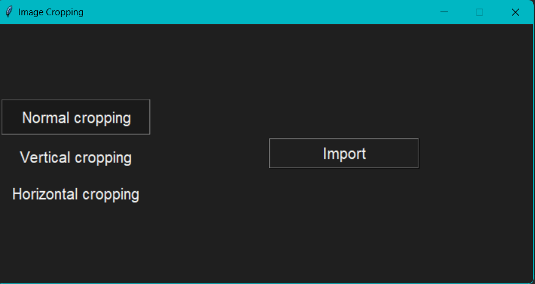
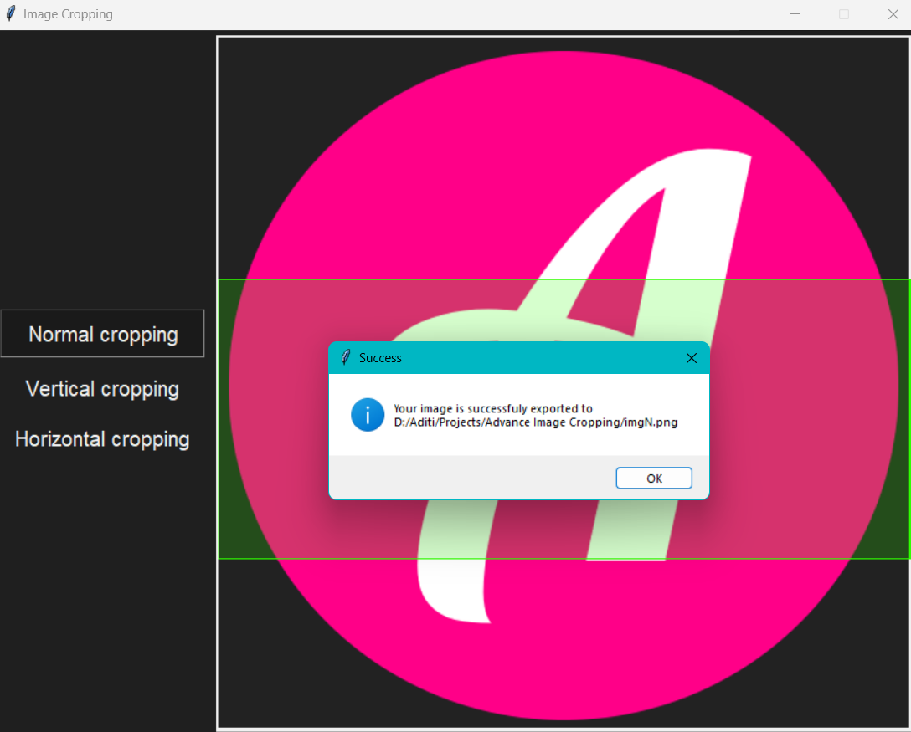
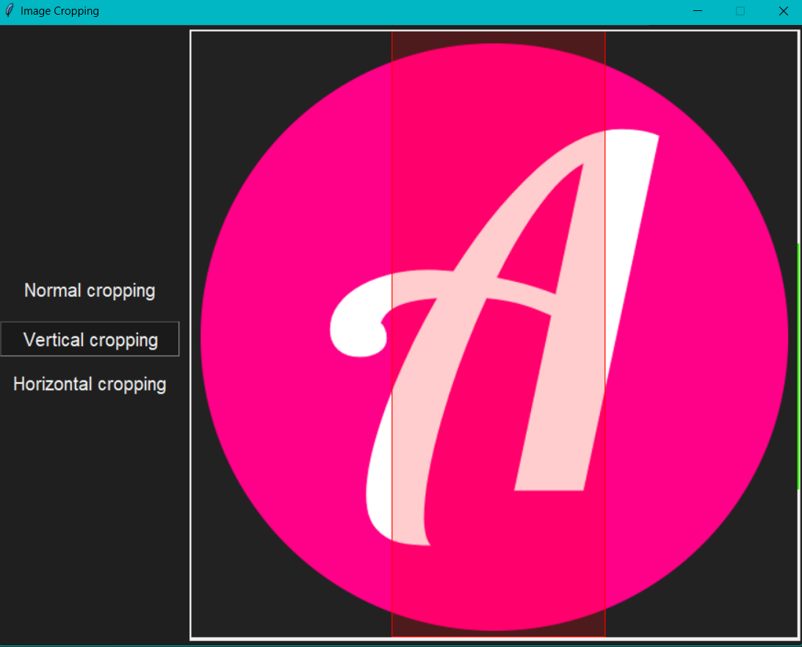

Advance Image cropping
---

✅ Patent filed.
---
***
This is a desktop based application which can :
1) Normally crop margins of a image.
2) Horizontally crop middle portion of image and join other two portions (top and bottom) in resultant image.
3) Vertically crop middle portion of image and join other two portions (left and right) in resultant image.
***
Techologies used:
---
1) python
2) tkinter
3) pillow
***
How to use : 
---
1) Import image-- It allows you to navigate your file system.
2) Perform cropping by selecting area with mouse.
3) Press ENTER to save result in desired location.
***
Use cases : 
---
✨ Cropping out scribbles from a image of notes.

✨ Cropping out answers from a image containing both questions and answers.

✨ Cropping out a person standing in middle from a group photo.
***
This application has a huge scope for future improvements where it can perform smart cropping.
***
Glimpses
---
Main screen
---

---

---

---
Normally cropped image
---

---
Horizontally cropped image
---

---
Vertically cropped image
---

